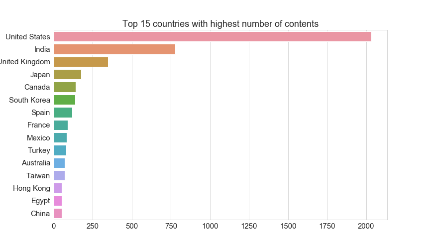
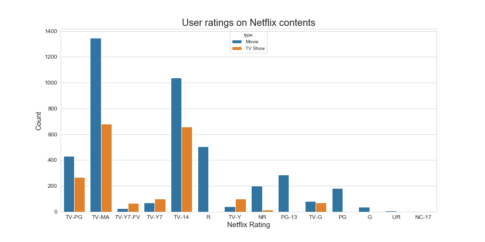
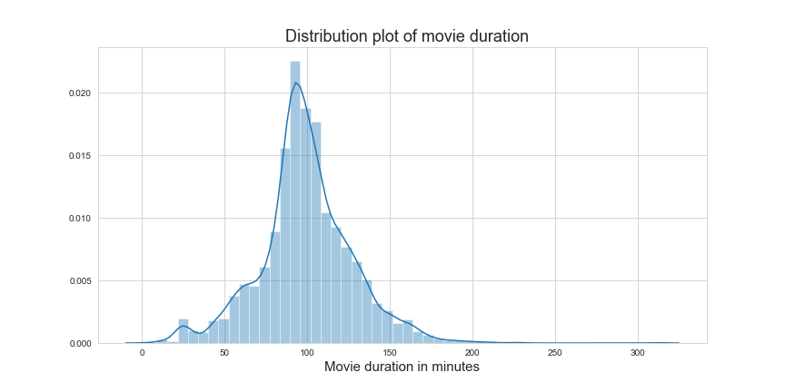

# Data Analysis With Pandas
Exploratory data analysis of Netflix movies and tv shows

### Data Source:
https://www.kaggle.com/shivamb/netflix-shows
####  In this notebook I am going to try explore the data I have and going to answer questions like:

 - What are the percentage of different content types on Netflix
 - What is the number of contents added over the years on Netflix
 - What are the user ratings on Netflix contents
 - Which country released highest number of contents.
 - What is the average length of movies
 - What combination of countries  and content types are most common?
 - What are the oldest TV Shows  and Movies on Netflix.
 - Which director made how many movies in each release_year
 
 

